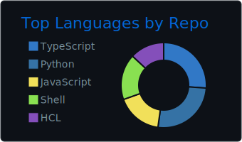
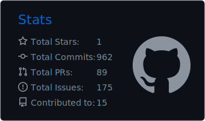

<div align="center">
  <h1>Welcome to my GitHub Profile!</h1>
  <p>
    <a href="https://x.com/argondev22/">
      
    </a>
    <a href="https://www.linkedin.com/in/argondev22/">
      
    </a>
    <a href="https://qiita.com/argondev22/">
      
    </a>
    <a href="https://speakerdeck.com/argondev22/">
      
    </a>
  </p>
</div>

<br>

##  About Me

```typescript
const argon = {
  bio: "Software Engineer | Cloud Engineer",
  currentlyLearning: ["DevOps", "Vibe Coding", "Cloud Platform"],
  interests: ["Cloud Platform", "Platform Engineering", "DevOps", "SRE", "Infrastructure as Code", "System Architecture", "Modern Web Development"],
  motto: "Continuous learning and improvement"
};
```

- 🧑‍💻 Passionate about building scalable web applications and cloud infrastructure
- ☁️ Experienced in **AWS** and **GCP** cloud platforms
- 🚀 Always exploring new technologies and best practices
<br>

## 💻 Tech Stack

<div align="center">

### Cloud & Infrastructure


### Languages & Frameworks


### Tools & Platforms


<!-- 
### AI Tools & Assistants

<span style="display: inline-block; margin: 0 5px;">
  
  
  
  
  
</span>
-->

</div>

<br>

## 🏅 Certifications

<div align="center">
  
  
  
  
  
</div>

<br>

## 📊 GitHub Statistics

<div align="center">
  
  
</div>

<div align="center">
  
</div>

<!-- 
<div align="center">
  
</div>
-->

<br>

## 📚 Continuous Learning

<div align="center">
  <a href="https://www.udemy.com/user/cun-lai-biao-ya/">
    
  </a>
  <a href="https://github.com/users/argondev22/projects/21">
    
  </a>
</div>

<br>
<br>
<br>

<div align="center">
  
</div>
