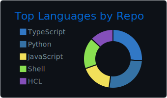
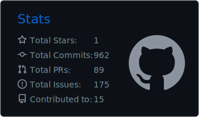

### Hi, I'm argon 👋

I'm a Solutions Architect at [Classmethod](https://classmethod.jp/), working primarily with [AWS](https://aws.amazon.com/) and [Anthropic's Claude](https://www.anthropic.com/claude) to design cloud and generative AI solutions.

Within AWS, I focus on [Amazon Bedrock](https://aws.amazon.com/bedrock/) — building agentic, production-grade AI on top of it.

I write about what I build over on [Developers.IO](https://dev.classmethod.jp/). Come take a look 👀

 

 
 

